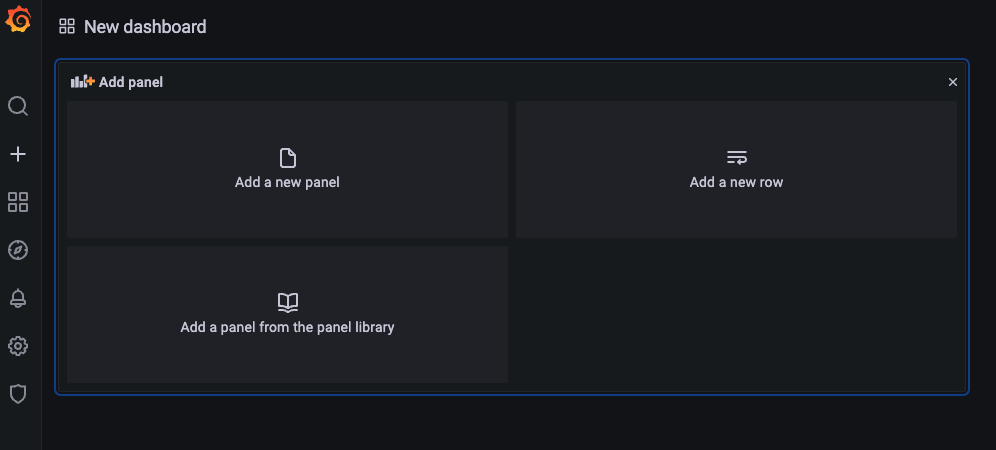
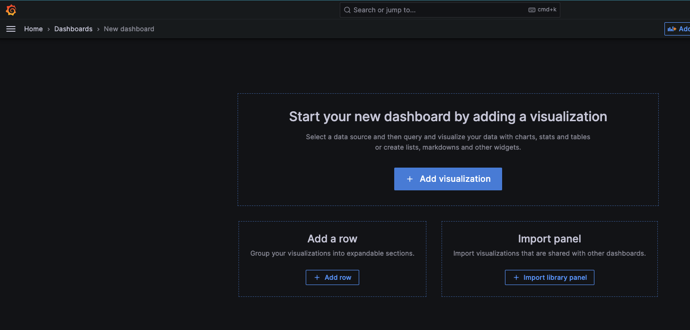
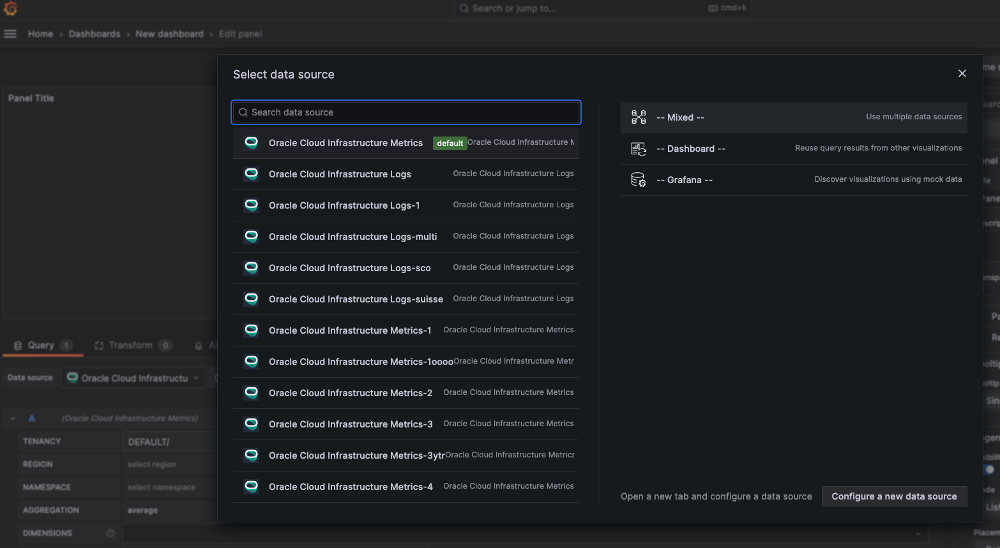
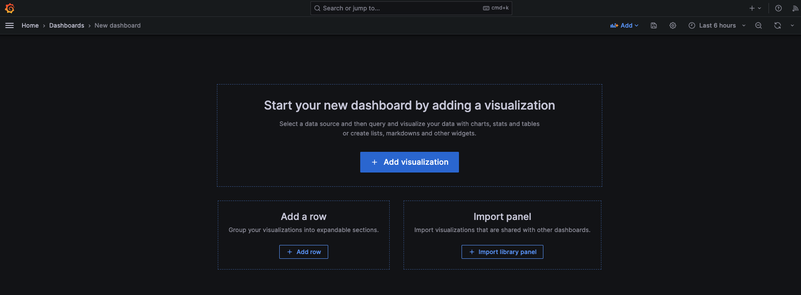
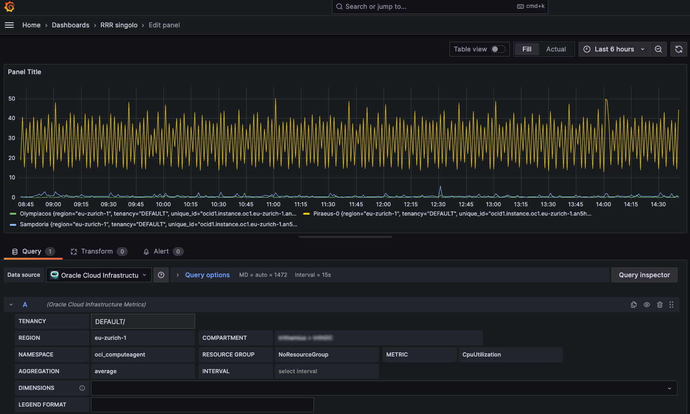
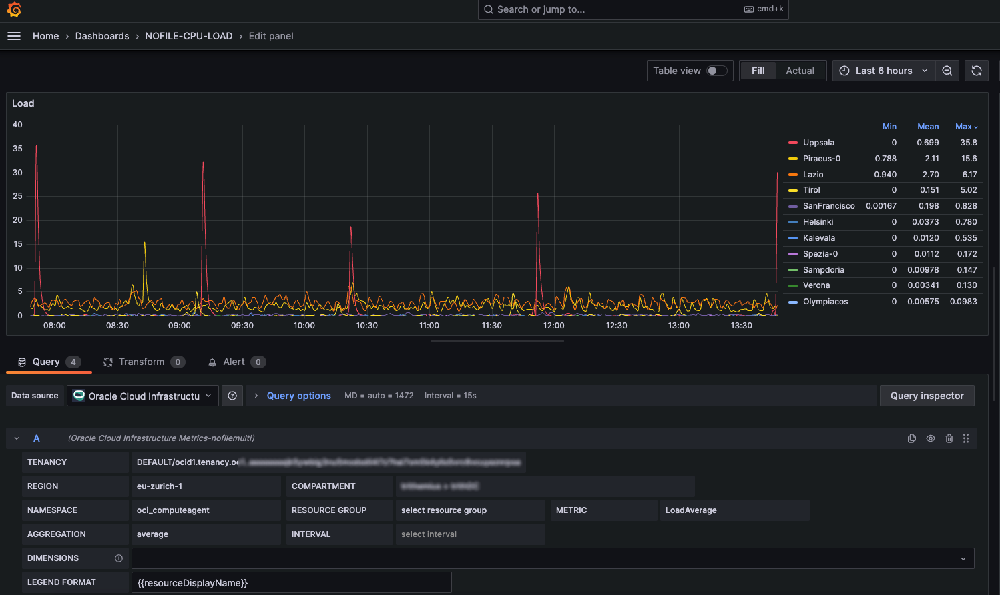
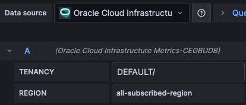
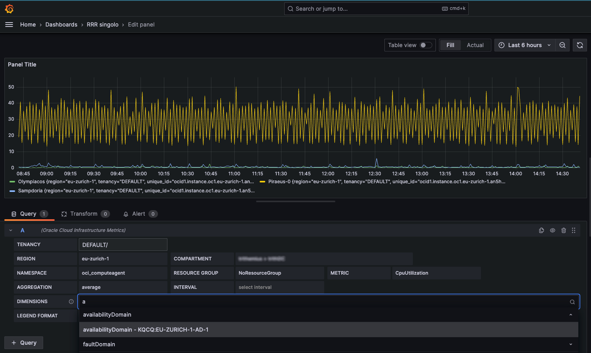
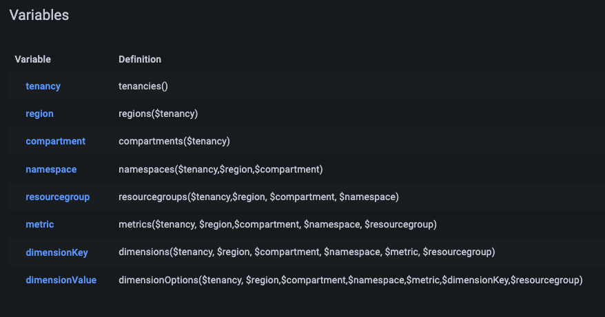
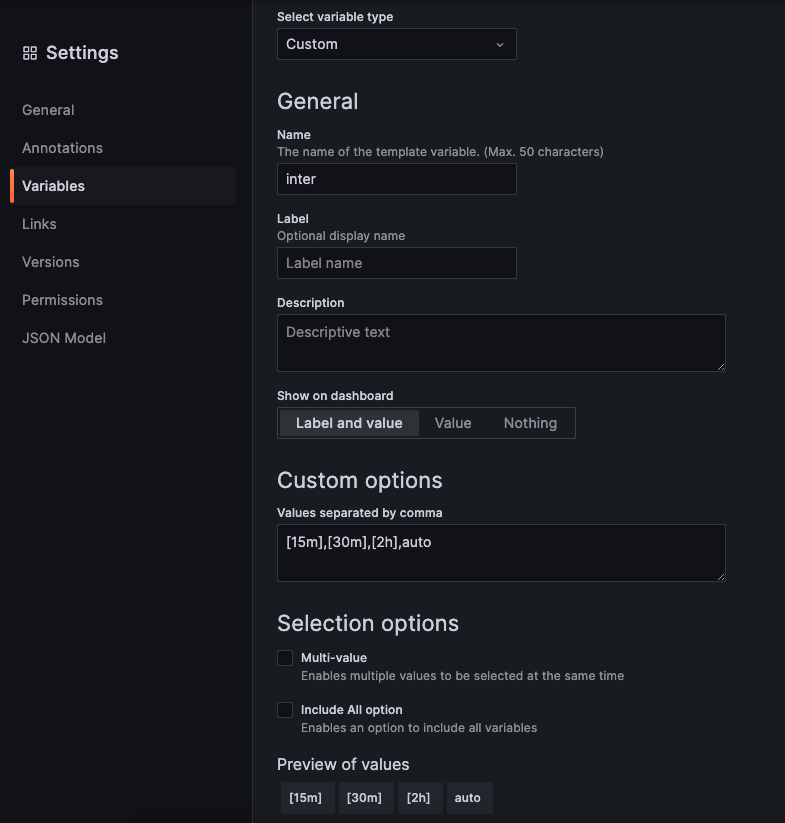

# Using Grafana with the Oracle Cloud Infrastructure Data Source 

Here are a few tools for you to explore after installing and configuring the Oracle Cloud Infrastructure Data Source for Grafana. Refer to [this page](https://docs.cloud.oracle.com/iaas/Content/Monitoring/Concepts/monitoringoverview.htm) for more information about how to use the Monitoring Service. 

## Migrate to Version 5.x 
Version 5 of the plugin generally maintains backward compatibility with previous versions. In general, Dashboards do not need to be modified, with a couple of exceptions:

- Dashboards that are set up to use one or more dimension template variables need to be modified by removing the dimensionsKey variable and using the new dimension variable that contains both key and value.See [**Templating**](#templating) for further details.
- Dashboards that are set up to use dimension key and dimension value must be modified to make use of the new dimension field. See [**here**](#new-dimension-selector-in-version-5-of-the-plugin) for further details.
- Dashboards that are configured in raw mode and are created in version 3 of the plugin must be modified to make use of the new raw mode interoduced in version 5 of the plugin will accept MQL query. See [**here**](#mql-editor) for further details.

## Multitenancy support

This version of the OCI plugin includes multitenancy support. That means that the plugin is able to query different tenancies as they are configured in the .oci/config file. Instance principals are not yet supported to operate in multitenancy mode.
For existing grafana dashboards created with the legacy single tenancy plugin datasource configuration, retro compatibility is supported under the following schema:


|                                                   | Dashboard created with plugin configured with .oci/config file | Dashboard created with plugin configured with instance principals |
| --------------------------------------------------- | ---------------------------------------------------------------- | ------------------------------------------------------------------- |
| New Plugin release with existing Datasource configuration | Dashboard should load with no action required                  | Dashboard should load with no action required  |
| New Plugin release with single tenancy Datasource | Dashboard should load with no action required                  | Dashboard should load with no action required   |
| New Plugin release with multitenancy Datasource   | Dashboard should be modified selecting the tenancy             | Dashboard should be modified selecting the tenancy                |


In general, Dashboard does not require to be modified if the dashboard will continue to use the datasource with which it was created and in case it will use a datasource configured in single tenancy mode. If the legacy dashboard will be imported into a multitenancy configured datasource, then the dashboard needs to be modified, including the tenancy to be used, and then saved, as in the following example:


## Query Editor

The query editor can be used to create graphs of your Oracle Cloud Infrastructure resources.

On the Grafana Home Dashboard and click **New Dashboard**.

For **Grafana 8**:


For **Grafana 9** and **Grafana 10**:


After **New Dashboard**, you then can add a **New Panel** or a **Visualization** depending on your Grafana version.

In **Grafana 8** add a new panel:


In **Grafana 9** add a visualization:


In **Grafana 10** first choose the datasource to add Visualization:

and then add the new panel:


If you are using a Data Source configured in **single** mode then choose the appropriate **Region**, **Compartment**, **Namespace**, **Metric**, and **Dimension** from the list of available options.



If you are using a Data Source configured in **multitenancy** mode then choose the appropriate **Tenancy**, **Region**, **Compartment**, **Namespace**, **Metric**, and **Dimension** from the list of available options. In **multitenancy** mode you can also combine two queries retrieving data from different datasources as in the following example:



If your tenancy is subscribed to more than one region and you want to query the same metric in all subscribed regions, you can use the **all-subscribed-region** option as in the following example:



Please note that querying using **all-subscribed-region** option can take significantly more time than querying only one region, depending on the number of the subscribed regions. 

Click the save icon to save your graph.

At this stage, if the **metrics** pull-down menu is not properly populating with options, you may need to navigate back to the OCI console and add an additional matching rule to your Dynamic Group stating: `matching_rule = “ANY {instance.compartment.id = ‘${var.compartment_ocid}’}”`. After doing so, restart the Grafana server as the **sudo** user run `systemctl restart grafana-server` and reload the Grafana console. 

## New Dimension selector in Version 5 of the plugin.

Version 5 of Grafana metrics plugins introduces a new selector for the dimensions which encompass dimension key and dimension value. If you are transitioning a dashboard created with previous version of the plugin which is making use of the dimensions, then you need to re-select the dimensions using the new selector and save the dashboard.

Use the new selector and start type the dimension label you want to add:


When you will find the dimension you want to add, then click on its label and select the key:



## Templating 

Templating provides the ability to dynamically switch the contents of graphs as seen in the example below. 


In order to configure templating, click on the gear icon in the upper right corner of the dashboard creation page from the previous step. This will take you to the **Settings** page. Click the **Variables** tab and then click the **Add variable** button. 


### Templating in Single Tenancy Mode

If the datasource is configured in **single** tenancy mode then use the following setup:

Add the **region** variable to this page. Give the variable the name `region`, choose **OCI** from the list of data sources, and for **Query** enter `regions()`. 


The page will load a preview of values available for that variable. Scroll down and click **Add** to create a template variable for regions. 


If you are using **Version 5** or newer of the plugin, repeat the process for the following OCI variables: 

| Name            | Query                                                                     |
| --------------- | ------------------------------------------------------------------------- |
| region          | `regions()`                                                               |
| compartment     | `compartments()`                                                          |
| namespace       | `namespaces($region,$compartment)`                                        |
| resourcegroup   | `resourcegroups($region, $compartment, $namespace)`                                        |
| metric          | `metrics($region,$compartment, $namespace, $resourcegroup)`                                |
| dimension    | `dimensions($region, $compartment, $namespace, $metric, $resourcegroup)`                     |


If you are using **Version 4** or older of the plugin, repeat the process for the following OCI variables: 

| Name            | Query                                                                     |
| --------------- | ------------------------------------------------------------------------- |
| region          | `regions()`                                                               |
| compartment     | `compartments()`                                                          |
| namespace       | `namespaces($region,$compartment)`                                        |
| resourcegroup   | `resourcegroups($region, $compartment, $namespace)`                                        |
| metric          | `metrics($region,$compartment, $namespace, $resourcegroup)`                                |
| dimensionKey    | `dimensions($region, $compartment, $namespace, $metric, $resourcegroup)`                     |
| dimensionValue  | `dimensionOptions($region,$compartment,$namespace,$metric,$dimensionKey,$resourcegroup)` |

All of the metrics plugin template variables only support a singleton value except the dimension options template variable. For the dimension options template variable, the Multi-value can be choosen selecting the variable name as lable and key in the multiselector dropdown, as shown here:


The final list of variables should look like this (**Plugin v4** and below): 


The final list of variables should look like this (**Plugin v5** and above): 


In order for these variables to be available to be dynamically changed in your query, edit your existing query, and under **metrics** select the newly created variables for **region**, **compartment**, **namespace**, and **metric** as seen in the image below. 


### Templating in Multi-Tenancy Mode

With the plugin configured to operate with multitenancy support, add the **tenancy** variable to this page. Give the variable the name `tenancy`, choose **OCI** from the list of data sources, and for **Query** enter `tenancies()`.


Add the **region** variable to this page. Give the variable the name `region`, choose **OCI** from the list of data sources, and for **Query** enter `regions($tenancy)`.


The page will load a preview of values available for that variable. Scroll down and click **Add** to create a template variable for regions.


If you are using **Version 5** or newer of the plugin, repeat the process for the following OCI variables: 

| Name           | Query                                                                                             |
| ---------------- | --------------------------------------------------------------------------------------------------- |
| tenancy        | `tenancies()`                                                                                     |
| region         | `regions($tenancy)`                                                                               |
| compartment    | `compartments($tenancy)`                                                                  |
| namespace      | `namespaces($tenancy,$region,$compartment)`                                                       |
| resourcegroup  | `resourcegroups($tenancy,$region, $compartment, $namespace)`                                      |
| metric         | `metrics($tenancy,$region,$compartment, $namespace, $resourcegroup)`                              |
| dimension   | `dimensions($tenancy,$region, $compartment, $namespace, $metric, $resourcegroup)`                 |


If you are using **Version 4** or older of the plugin, repeat the process for the following OCI variables: 
| Name           | Query                                                                                             |
| ---------------- | --------------------------------------------------------------------------------------------------- |
| tenancy        | `tenancies()`                                                                                     |
| region         | `regions($tenancy)`                                                                               |
| compartment    | `compartments($tenancy)`                                                                  |
| namespace      | `namespaces($tenancy,$region,$compartment)`                                                       |
| resourcegroup  | `resourcegroups($tenancy,$region, $compartment, $namespace)`                                      |
| metric         | `metrics($tenancy,$region,$compartment, $namespace, $resourcegroup)`                              |
| dimensionKey   | `dimensions($tenancy,$region, $compartment, $namespace, $metric, $resourcegroup)`                 |
| dimensionValue | `dimensionOptions($tenancy,$region,$compartment,$namespace,$metric,$dimensionKey,$resourcegroup)` |


In Multitenancy mode, it is recommended to click the 'save template variable state' radio button when saving a dashboard using template variables.

All of the metrics plugin template variables only support a singleton value except the dimension options template variable. For the dimension options template variable, the Multi-value can be choosen selecting the variable name as lable and key in the multiselector dropdown, as shown here:


The final list of variables should look like this (**Plugin v4** and below):



The final list of variables should look like this (**Plugin v5** and above): 


### Template variable for interval

For intervals, you can use a custom or constant variable. To create a custom, select the variable type as custom. 
Label(appears as the display name of the variable selected).

Custom variables provide the convenience of using custom intervals for your dashboard. Please note the accepted format for intervals are within squared brackets and must include the time unit (for example [5m] to specify 5 minutes or [2h] for two hours). Following is an example of interval template variable definition:



### Windows and Resolution

For windows and resolution, you can use a custom or constant variable. To create a custom, select the variable type as custom. 
Label(appears as the display name of the variable selected)
  
Custom variables provide the convenience of selecting a value out of many values. Try replicating the data in the following screenshots for window and resolution.

Custom window variable 


Custom resolution variable


Choose the save button to save your dashboard! DO NOT FORGET 


Now, on the top of the panel, you would see windowLabel and resolutionLabel
You can select the value for the variables from here  and use them in
the dropdowns window and resolution  below the panel


In case the plugin is configured to operate with multitenancy support, please make sure you are selecting **region** before **tenancy** and all the other dropdowns.
 

### Dimensions

Dimensions can be used to add specificity to your graphs. To use dimensions create a new graph or navigate to an existing one and click the **Metrics** tab. After selecting your variables click the **+** next to **Dimensions** and select one of the tag filters from the list. For example, select `availabilityDomain` from the list. Next, click **select value** and choose from the newly populated list of dimension values. If you chose `availabilityDomain` as your tag filter, you should see dimension values corresponding to the availability domains in which you currently have services provisioned, for example `US-ASHBURN-AD-1`. 


### Metric Label Customization

When the metric plugin performs a query defined in a data panel, the query results contain the queried metric name, the values of the metric in the specified time range, and the values of the dimensions associated with the resource to which the metric pertains. The plugin by default generates a label for each of the metrics returned in the query results of the form:

    <Metric Name>[<Dimension 1 value> | <Dimension 2 value> | ... <Dimension N value>]

where each of these placeholders is replaced by the relevant metric name and dimension values for a given metric. This label is what is shown in the panel legend to distinguish each metric. Metric dimensions that contain a resource OCID, either the ID of the resource with which the metric is associated or an OCI resource related to the resource with which the metric is associated, contain the full resource OCID.

Many OCI metrics have quite a few dimensions, as a result, the default label in a data panel legend for such metrics may be quite long. The metrics plugin provides a means for you to customize the presentation of metrics labels in a data panel legend via the **Legend Format** field in the metrics query editor as shown in the following image.


The Legend Format field for a metrics query can contain any literal text sequences (printable characters only) along with any number of the following placeholders. 

| Placeholder       | Value that will replace the placeholder           |
| ----------------- | ------------------------------------------------- |
| {{metric}}        | The name of metric	                            |
| {{dimensionName}} | The value of the specified metric dimension name  |

When the Legend Format field contains a defined format, the metrics plugin will generate a label for each metric that follows the defined format where each of the referenced placeholders is replaced by the relevant value for the metric. Any placeholders (or other text) in the legend format that do not line up with one of these placeholders will be unchanged. Note that placeholder labels are treated as case sensitive.

Examples of custom legend formats that could be defined for metrics associated with OCI resources include:

| Metric Namespace  | Example Metric   | Example Legend/Label Format                     | Example Resulting Metric Label    |
| ----------------- | ---------------- | ----------------------------------------------- | --------------------------------- |
| oci_computeagent  | CpuUtilization   | {{metric}} - {{resourceDisplayName}}            | CpuUtilization - InstanceName-123 |
| oci_computeagent  | DiskBytesWritten | {{availabilityDomain} - {{resourceDisplayName}} | bwAI:PHX-AD-2 - InstanceName-456  |
| oci_lbaas	        | BytesReceived    | {{lbName}} / {{backendSetName}}                 | myLB / backendset1                |
| oci_objectstorage	| ObjectCount      | {{tier}} ^ {{resourceDisplayName}}              | NORMAL ^ myBucketName             |
| oci_filestorage   | FileSystemUsage  | resourceId={{resourceId}}                       | resourceId=ocid1.filesystem....   |

Please note that custom labels are supported for OCI resource service metrics only. Custom metrics generated by scripts or by UMA do not support custom labels. 

## Custom Metrics and Namespaces

Oracle Cloud Infrastructure allows you to create [custom metrics namespaces](https://docs.cloud.oracle.com/iaas/Content/Monitoring/Tasks/publishingcustommetrics.htm), which can be used to ingest data from sources in addition to the native Oracle Cloud Infrastructure resources available by default. For example, an application could be instrumented to gather statistics about individual operations. The resource posting custom metrics must be able to authenticate to Oracle Cloud Infrastructure using either using the Oracle Cloud Infrastructure CLI authentication mentioned above or using [instance principals](https://docs.cloud.oracle.com/iaas/Content/Identity/Tasks/callingservicesfrominstances.htm). In the example below you can see the option to select `custom_namespace` from the **Namespace** drop down. 


You can also see two custom metrics `CustomMetric` and `CustomMetric2` from the **Metric** dropdown. 


----

Now, variables can be used in  window and resolution drop downs

#### MQL editor

Version 5 of the OCI Metrics plugin introduces a new react based MQL editor raw mode. Please note that this new raw query editor is **not compatible with query editor used in versions up to 3.x of the plugin**. If you are migrating an old dashboard created with version 3.x or below of the plugin which is using the raw query editor, you must reconfigure it using the new Raw Query mode as described below.

Toggle the Raw Query/Builder selector, and switch to Raw Query to enter editor mode:


For now, only the following fields can be updated in the raw query editor mode,
1. Metric
2. Window
3. Aggregation
4. Dimensions

All other fields must be selected using the drop-downs.

Example:
Try pasting this ```AllRequests[1m].max()```

[1m] represents the value of the window. Similarly, the value can be set to 2m, 3m, 1h, etc
where the 1st part represents a number and the second part represents the time denomination. 


| symbol            | Meaning                                                                     |
| --------------- | ------------------------------------------------------------------------- |
| s          |  second                                                           |
| m          |  minute                                                           |
| h          |  hour                                                           |

Note: Only lower cases are allowed for the above


###### Query with variables 

Variables can be used for window selection ```AllRequests[$window].max()```

Query with 'auto'.

Auto can be used to select the window automatically depending upon the time range,
selected. ```AllRequests[auto].count()```


---- 

### Auto explained
Auto option is available for window and resolution. This helps the user to 
get an automatic configuration for window and resolution based on the following conditions. 

If the user selects a time range

1. Less than or equal to  7 days ->  window will be 1m and resolution will be 1 min
2. Less than or equal to  30 days and more than 7 days ->   window will be 5m and resolution will be 5 min.
3. More than 30 days -> a window will be 1h and resolution will be 1 h   
 
## Alerting
Version 5.5 of the metrics plugin introduces the Alerting capability.
For detailed instruction how to work with alerts in Grafana, you may reference to the official documentation available at [Grafana Alerting](https://grafana.com/docs/grafana/latest/alerting/) web page.

The overall procedure is like the following (in Grafana 10):
1. Open the dashboard you created earlier
2. Edit any existing panel.
3. Click on the Alert tab underneath the panel.
4. Click on Create alert rule from this panel button.
5. In Expressions section, in the Threshold expression C, set the threshold
6. Click on Set as alert condition on Threshold expression C. Your alert should now look as follows:

Expression section showing B &quot;reduce&quot; with Input: A, Function: Last, Mode: Strict, C Threshold with Input: B, Is Above: 15 and Alert Condition enabled indicator
Expression section showing B "reduce" with Input: A, Function: Last, Mode: Strict, C Threshold with Input: B, Is Above: 15 and Alert Condition enabled indicator
7. In Set alert evaluation behavior section, click on New folder button and create a new folder to store an evaluation rule.
8. Then, click on New evaluation group button and create a new evaluation group; choose a name and set the Evaluation interval.
9. Click Save rule and exit button.
10. Save the dashboard.

After some time the alert rule evaluates and transitions into Alerting state.

### Known limitations with Alerts
Please note that Alerting is **not** compatible with custom label function. That means you must remove any custom label in the alert definition window, if any. custom labels can stay in the panels and dashboards, must be removed only in alert definition window.
If you try to set up an alert with some custom label, you will see this error:

